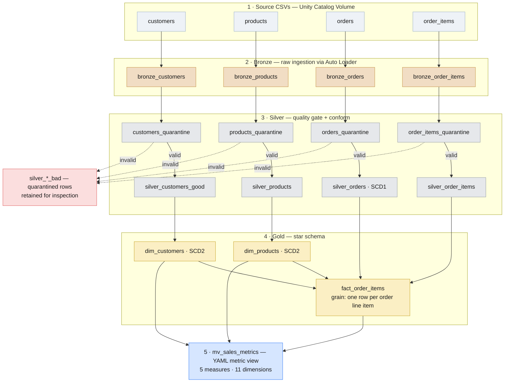

# TechMart — Lakeflow Declarative Pipeline on Databricks


An end-to-end data warehouse pipeline for a fictional e-commerce retailer (**TechMart**), built on Databricks using **Lakeflow Declarative Pipelines** and a **medallion (bronze → silver → gold) architecture**. The pipeline ingests raw sales data, enforces data quality, models slowly changing dimensions, and exposes a governed semantic layer that powers year-over-year sales analytics.

Built as the capstone project for the Telerik Academy Data Engineering program, then extended toward production-grade correctness.

---

## Architecture



The pipeline ingests **four source datasets (~11M rows)** and produces a star schema with two SCD Type 2 dimensions, one fact table at order-line-item grain, and a YAML metric view consumed by analytical queries.

---

## Tech stack

| Layer | Technology |
|---|---|
| Platform | Databricks (serverless), Unity Catalog |
| Pipeline framework | Lakeflow Declarative Pipelines (`pyspark.pipelines`) |
| Ingestion | Auto Loader (`cloudFiles`) with schema evolution |
| Processing | PySpark, Spark SQL |
| Storage | Delta Lake |
| CDC / history | Auto CDC flows (SCD Type 1 & Type 2) |
| Semantic layer | Unity Catalog metric view (YAML) |
| Deployment | Databricks SDK (`WorkspaceClient`) |

---

## Data model

**Sources** (CSV, landed in a Unity Catalog volume): `customers`, `products`, `orders`, `order_items`.

**Star schema:**

- `dim_customers` — SCD Type 2 (tracks changes to location, email, etc.)
- `dim_products` — SCD Type 2 (tracks price and catalog changes; derives a `price_tier`)
- `fact_order_items` — **grain: one row per order line item**, with surrogate foreign keys to both dimensions and a computed `line_total`

---

## Pipeline layers

### Bronze — raw ingestion
Each source is ingested as a **streaming table via Auto Loader** with `inferColumnTypes` and `schemaEvolutionMode = addNewColumns`, so the pipeline tolerates schema drift without manual intervention. Every row is stamped with lineage metadata — source file name, file modification time, and ingestion timestamp — for full auditability.

### Silver — cleansing, quality, and conforming
- **Quarantine gate (every source):** each source passes through a temporary `<table>_quarantine` table that flags rows with `is_quarantined` and applies pipeline **expectations**, then splits into a validated downstream stream and a published `silver_<table>_bad` table — so failing data is *retained for inspection* rather than silently dropped. Rule sets are calibrated per table to its real failure modes (null keys, negative prices, out-of-range discounts), keeping the gate present on every ingestion path even where today's data rarely trips it. For customers, emails are also normalized to lowercase and names conformed into `full_name`.
- **SCD Type 1 (orders):** orders represent mutable transactional state where only the latest version matters, so they are deduplicated with an **Auto CDC flow** (`stored_as_scd_type=1`, sequenced by `created_at`).
- **Referential integrity (order_items):** `silver_order_items` is filtered to keep only items whose `order_id` exists in `silver_orders`, dropping orphan lines.

### Gold — dimensional model
- **SCD Type 2 dimensions:** `dim_customers` and `dim_products` are built from Auto CDC SCD2 flows, materializing `valid_from` / `valid_to` / `is_current`. For customers, the earliest version's `valid_from` is back-dated to `signup_date` so history is anchored to the real start of the relationship rather than the first CDC observation.
- **Surrogate keys:** generated with `xxhash64(business_key, __START_AT)` — deterministic and **version-aware**, so every SCD2 version receives a stable, unique key.
- **Fact table:** `fact_order_items` inner-joins items to orders, then performs **temporal as-of joins** to both dimensions (`order_date BETWEEN valid_from AND valid_to`), attributing each line to the dimension version that was current *at order time* — point-in-time correct and free of SCD2 fan-out. Unmatched keys default to a `-1` sentinel.

### Semantic layer — metric view
`mv_sales_metrics` is a **YAML metric view** (5 measures, 11 dimensions) over the gold layer. Measures include `total_revenue`, `total_orders` (distinct), `total_items_sold`, `avg_order_value` (with a `NULLIF` divide-by-zero guard), and `avg_discount`. Analytical queries consume it via the `MEASURE()` function, keeping aggregation logic defined once and reused everywhere.

---

## Key design decisions

| Decision | Rationale |
|---|---|
| Quarantine gate on every source (not just customers) | A data-quality gate belongs on all ingestion paths for architectural consistency. Failing rows are routed to `silver_*_bad` tables for root-cause analysis instead of being dropped, while per-table rule sets stay light where the data is clean — so the gate is present everywhere without over-engineering. |
| SCD1 for orders, SCD2 for customers/products | Orders are corrected-in-place transactional facts (latest wins); customer and product attributes need full history for point-in-time analysis. |
| Temporal as-of joins in the fact table | Each line item is attributed to the dimension version valid at `order_date`, preventing the row fan-out that a naive join against SCD2 history would cause. |
| `xxhash64(business_key, __START_AT)` surrogate keys | Deterministic and version-aware: re-runs produce identical keys, and each SCD2 version is uniquely addressable. |
| Fact carries surrogate keys **and** the metric view re-joins on natural keys | The fact preserves star-schema SKs for BI tools that navigate by surrogate key; the metric view re-resolves descriptive attributes through the same temporal predicates to remain a self-contained semantic layer. |
| `-1` sentinel for unmatched dimension keys | Keeps the fact fully populated and join-safe even when a dimension lookup misses, rather than producing nulls that break downstream aggregations. |

---

## Analytical outputs

The reports notebook runs three year-over-year analyses against the metric view:

1. **Monthly YoY revenue** — `total_revenue` for 2024 vs 2025 by month, with growth %.
2. **Category YoY growth** — `total_items_sold` per product category, year over year.
3. **Country performance** — `total_revenue` per country, year over year.

All three read exclusively from `mv_sales_metrics` via `MEASURE()`, so the metric definitions stay consistent across every report.

---

## Repository structure

```
techmart-sdp-pipeline/
├── README.md
└── notebooks/
    ├── 01_data_exploration.py   # source profiling: nulls, casing, duplicate orders
    ├── 02_sdp_pipeline.py       # the pipeline: bronze → silver → gold
    └── 03_reports.py            # SDK deployment, metric view, YoY queries
```

> The notebooks are Databricks notebooks exported in source format (`# Databricks notebook source`). Import them into a Databricks workspace, or sync via Databricks Repos / Asset Bundles.

---

## Running the pipeline

1. **Land source data** in a Unity Catalog volume, e.g. `/Volumes/<catalog>/techmart/raw_data/{customers,products,orders,order_items}`.
2. **Create the pipeline** with `02_sdp_pipeline.py` as the source notebook. It reads three configuration values:

   | Key | Example |
   |---|---|
   | `catalog` | `telerik_u57_de_workspace` |
   | `schema` | `kostadin_kotev` |
   | `raw_data_path` | `/Volumes/telerik_u57_de_workspace/techmart/raw_data` |

   `03_reports.py` provisions the pipeline programmatically via the Databricks SDK (serverless, triggered) and is idempotent — it reuses an existing pipeline if one matches the name.
3. **Run the pipeline**, then execute the metric-view creation and analytical queries in `03_reports.py`.

---

## Possible production extensions

- Broaden expectations (email format, non-negative quantity/price, valid discount range) and promote critical invariants to `expect_or_fail`.
- Materialize an explicit "Unknown" member row (key `-1`) in each dimension to pair with the fact sentinel.
- Build a data-quality trend dashboard from the pipeline event log.
- Add transformation unit tests and CI/CD via Databricks Asset Bundles.

---

## Author

**Kostadin Kotev** — Data Engineer, Sofia
[LinkedIn](https://www.linkedin.com/in/kostadin-kotev)
